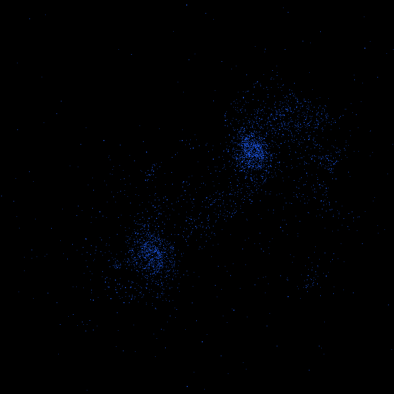
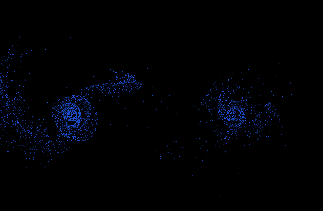

# ParticleSimulation
A particle simulation made with OpenGL and C++ by Omppu42 <br> <br>

 




## Running
Download and extract the project. <br>
Navigate to ```\Release``` and run ```ParticleSimulation.exe``` <br>

### Made using Windows. You may encounter unexpected behavior when using other platforms. <br>
  
## Editing
### Use Visual Studio 2022 to edit the project <br>
Open the solution file in VS 2022 <br> <br>
You can edit the values in ```\ParticleSimulation\src\Application.cpp``` on line 90 <br>
To run, first save with ctrl + S and run with F5 <br> <br>
To update the ```.exe``` file, right click the solution in solution explorer and select ```Rebuild```